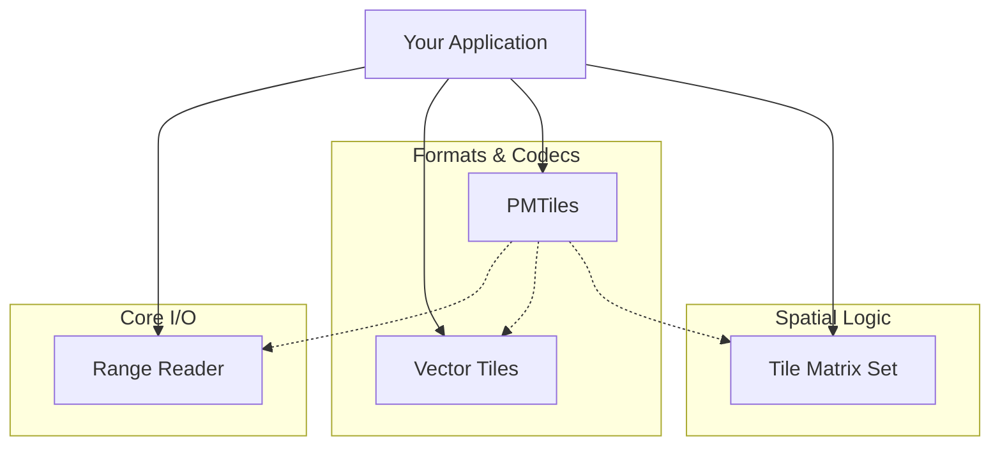

# Tileverse

**A high-performance, modular Java ecosystem for cloud-native geospatial data.**

[](https://central.sonatype.com/search?q=io.tileverse)
[](https://github.com/tileverse-io/tileverse/actions)
[](LICENSE)
[](https://openjdk.org/)

---

## Overview

**Tileverse** is a collection of loosely coupled Java libraries designed to solve the challenges of modern, cloud-centric geospatial applications. It provides the foundational blocks—efficient I/O, standardized tiling schemes, and robust format parsers—needed to build tile servers, ETL pipelines, and analytical tools.

Unlike monolithic GIS frameworks, Tileverse modules are designed to be **composable**. Pick exactly what you need: just the I/O layer for reading COGs from S3, just the math library for tile grid calculations, or the full stack for serving PMTiles.

## Modules

| Module | Description | Key Capabilities |
| :--- | :--- | :--- |
| **[Range Reader](tileverse-rangereader/)** | Unified I/O | Abstract byte-range access across **S3**, **Azure**, **GCS**, **HTTP**, and local files. Includes intelligent multi-level caching and block alignment. |
| **[PMTiles](tileverse-pmtiles/)** | Archive Format | Read/write support for the **[PMTiles v3](https://github.com/protomaps/PMTiles)** specification. Leverages `RangeReader` for cloud-optimized random access. |
| **[Vector Tiles](tileverse-vectortiles/)** | Data Encoding | High-performance encoding and decoding of **Mapbox Vector Tiles (MVT)** to/from JTS Geometries using Protocol Buffers. |
| **[Tile Matrix Set](tileverse-tilematrixset/)** | Spatial Logic | Implementation of the **OGC Tile Matrix Set** standard. Handles coordinate transforms, bounding box logic, and tile pyramid definitions. |

## Installation

Tileverse is available on Maven Central. We recommend using the **Bill of Materials (BOM)** to align versions across modules.

### Maven

```xml
<dependencyManagement>
  <dependencies>
    <dependency>
      <groupId>io.tileverse</groupId>
      <artifactId>tileverse-bom</artifactId>
      <version>1.1.0</version>
      <type>pom</type>
      <scope>import</scope>
    </dependency>
  </dependencies>
</dependencyManagement>

<dependencies>
  <!-- I/O Layer -->
  <dependency>
    <groupId>io.tileverse.rangereader</groupId>
    <artifactId>tileverse-rangereader-all</artifactId>
  </dependency>

  <!-- Format Support -->
  <dependency>
    <groupId>io.tileverse.pmtiles</groupId>
    <artifactId>tileverse-pmtiles</artifactId>
  </dependency>
</dependencies>
```

### Gradle

```gradle
dependencies {
    implementation platform('io.tileverse:tileverse-bom:1.1.0')

    implementation 'io.tileverse.rangereader:tileverse-rangereader-all'
    implementation 'io.tileverse.pmtiles:tileverse-pmtiles'
}
```

## Quick Start: Reading PMTiles from S3

This example demonstrates how the modules compose to solve a real-world problem: reading a specific map tile from an S3 bucket without downloading the entire archive.

```java
import io.tileverse.rangereader.s3.S3RangeReader;
import io.tileverse.rangereader.cache.CachingRangeReader;
import io.tileverse.pmtiles.PMTilesReader;
import java.nio.ByteBuffer;
import java.net.URI;

// 1. Configure the I/O layer (S3 + Memory Caching)
var s3Source = S3RangeReader.builder()
    .uri(URI.create("s3://my-bucket/maps/planet.pmtiles"))
    .region(Region.US_EAST_1)
    .build();

var cachedSource = CachingRangeReader.builder(s3Source)
    .capacity(50_000_000) // 50MB cache for headers/directories
    .build();

// 2. Initialize the Format Reader
try (var reader = new PMTilesReader(cachedSource::asByteChannel)) {
    
    // 3. Fetch a specific tile (z=0, x=0, y=0)
    Optional<ByteBuffer> tile = reader.getTile(0, 0, 0);
    
    tile.ifPresent(buffer -> {
        buffer.flip();
        System.out.println("Found tile: " + buffer.remaining() + " bytes");
        // Pass 'buffer' to VectorTileCodec to decode...
    });
}
```

## Ecosystem Architecture

The libraries are designed to work together but remain independent. `PMTiles` orchestrates the others, while `RangeReader`, `VectorTiles`, and `TileMatrixSet` are standalone utilities.



## Documentation

Complete documentation is available at **[tileverse.io](https://tileverse.io)**.

- **[Developer Guide](https://tileverse.io/developer-guide/)**: Building, testing, and contributing.
- **[Range Reader Guide](https://tileverse.io/rangereader/)**: Advanced caching and authentication.
- **[Javadoc](https://javadoc.io/doc/io.tileverse)**: API reference.

## Development

This is a standard Maven project wrapped with a Makefile for convenience.

*   **Java 21+** is required for building (runtime support starts at Java 17).
*   **Docker** is required for running integration tests.

```bash
make help      # Show all commands
make           # Build and test everything
make test      # Run unit & integration tests
make format    # Fix code style (Spotless)
```

## License

Released under the [Apache License 2.0](LICENSE).

Copyright &copy; 2025 Multiversio LLC.