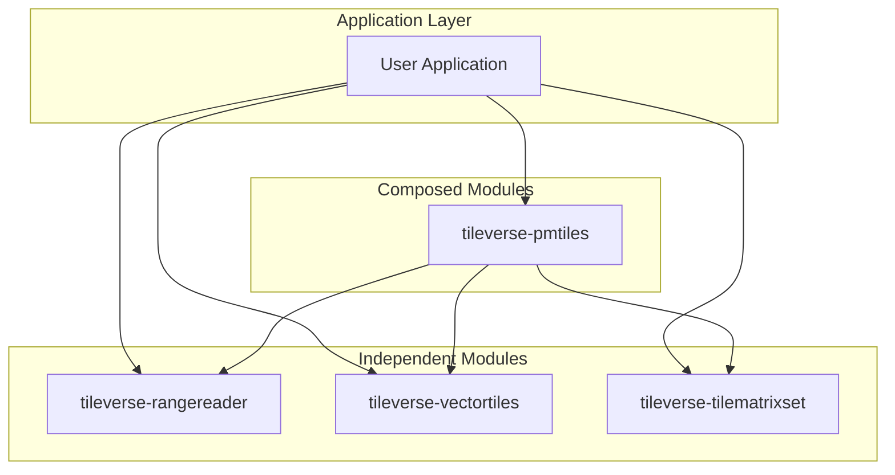

# System Architecture

Tileverse is designed as a collection of **loosely coupled, composable libraries**. While they work seamlessly together, each module acts as a standalone tool for its specific domain (I/O, Tiling, Encodings).

## Component Relationships

The following diagram illustrates how the libraries relate to user applications and each other. Note that `pmtiles` is the only module that strictly depends on others (`rangereader` for I/O and `vectortiles` for decoding).

## Design Philosophy

### 1. I/O Independence (`rangereader`)
We treat data access as a distinct problem from data format. 

*   **Goal:** Read bytes from anywhere (S3, HTTP, Azure, File) efficiently.
*   **Anti-Pattern:** Format libraries (like a GeoTIFF reader) implementing their own S3 clients.
*   **Solution:** `RangeReader` provides a unified `readRange(start, length)` interface.

### 2. Pure Mathematical Models (`tilematrixset`)
Spatial reference systems and grid logic are kept separate from data storage.

*   **Goal:** Calculate tile coordinates and bounding boxes without external dependencies.
*   **Benefit:** Can be used by a tile server to calculate grids even if the data source isn't Java-based or uses a different I/O library.

### 3. Format Specificity (`vectortiles`, `pmtiles`)
These libraries handle the parsing and encoding logic for specific file specs.

*   **Vector Tiles:** Pure Protocol Buffers / JTS transcoding. No I/O logic.
*   **PMTiles:** Orchestrates `RangeReader` to fetch specific directory bytes, uses `VectorTiles` to parse the result, and `TileMatrixSet` to understand the grid.

## Integration Patterns

### Direct Usage
Applications often use modules directly:

*   **ETL Pipelines:** Use `vectortiles` to convert PostGIS geometry to MVT bytes.
*   **Tile Servers:** Use `tilematrixset` to calculate which tiles cover a viewport.
*   **Data Access:** Use `rangereader` to fetch partial content from Cloud Optimized GeoTIFFs (COGs) stored on S3.

### Composed Usage
The `pmtiles` library demonstrates the power of composition:

1.  Accepts a `RangeReader` interface (polymorphic backend).
2.  Uses `HilbertCurve` (internal) for index lookup.
3.  Returns raw bytes or uses `vectortiles` to return parsed geometry.
