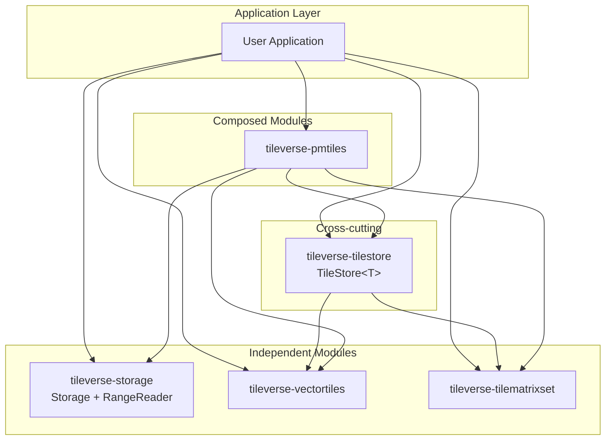

# System Architecture

Tileverse is designed as a collection of **loosely coupled, composable libraries**. While they work seamlessly together, each module acts as a standalone tool for its specific domain (I/O, Tiling, Encodings).

## Module map

The Tileverse monorepo ships six modules. Four are independent of each other; `tileverse-tilestore` builds on the format and grid libraries; `tileverse-pmtiles` is the only module that strictly depends on all the others (`tileverse-storage` for I/O, `tileverse-vectortiles` for MVT decoding, `tileverse-tilematrixset` for grid math, `tileverse-tilestore` for the high-level tile-store wrappers).

## System context

The Tileverse system sits between consumer applications and the four external storage families it speaks to (local FS, HTTP, S3-compatible object stores, Azure, GCS).

## Container view

All six monorepo modules plus their dependencies on each other and on the external storage systems. `tileverse-pmtiles` is the only module that depends on every other Tileverse module; `tileverse-tilestore` brings the format-agnostic `TileStore<T>` abstraction; the four storage containers (`-core`, `-s3`, `-azure`, `-gcs`) compose under `-all` for callers that want every backend at once.

Per-module C4 component views are embedded in each library's section:

- [Storage core internals](../../storage/explanation/internals.md)
- [PMTiles internals](../../pmtiles/index.md#component-view)
- [Vector Tiles internals](../../vectortiles/index.md#component-view)
- [Tile Matrix Set internals](../../tilematrixset/index.md#component-view)
- [Tile Stores internals](../../pmtiles/reference/tile-stores.md#component-view)

All C4 diagrams are generated from `docs/structurizr/workspace.dsl` via `docs/build.sh` (Docker required). Edit the DSL and rerun the build to regenerate.

## Design Philosophy

### 1. I/O Independence (`tileverse-storage`)
We treat data access as a distinct problem from data format.

*   **Goal:** Read (and write, list, copy, presign) bytes from anywhere (S3, HTTP, Azure, GCS, File) efficiently.
*   **Anti-Pattern:** Format libraries (like a GeoTIFF reader) implementing their own S3 clients.
*   **Solution:** `Storage` provides a unified container API; its `RangeReader` API exposes the byte-range read surface used by single-file consumers (PMTiles, COG, single-file Parquet).

### 2. Pure Mathematical Models (`tilematrixset`)
Spatial reference systems and grid logic are kept separate from data storage.

*   **Goal:** Calculate tile coordinates and bounding boxes without external dependencies.
*   **Benefit:** Can be used by a tile server to calculate grids even if the data source isn't Java-based or uses a different I/O library.

### 3. Format Specificity (`vectortiles`, `pmtiles`)
These libraries handle the parsing and encoding logic for specific file specs.

*   **Vector Tiles:** Pure Protocol Buffers / JTS transcoding. No I/O logic.
*   **PMTiles:** Orchestrates `RangeReader` to fetch specific directory bytes, uses `VectorTiles` to parse the result, and `TileMatrixSet` to understand the grid.

## Integration Patterns

### Direct Usage
Applications often use modules directly:

*   **ETL Pipelines:** Use `vectortiles` to convert PostGIS geometry to MVT bytes.
*   **Tile Servers:** Use `tilematrixset` to calculate which tiles cover a viewport.
*   **Data Access:** Use `tileverse-storage` (its `RangeReader` API) to fetch partial content from Cloud Optimized GeoTIFFs (COGs) stored on S3.

### Composed Usage
The `pmtiles` library demonstrates the power of composition:

1.  Accepts a `RangeReader` interface (polymorphic backend).
2.  Uses `HilbertCurve` (internal) for index lookup.
3.  Returns raw bytes at the reader level; high-level `*TileStore` wrappers decode on the fly: `PMTilesVectorTileStore` uses `vectortiles` to return parsed `VectorTile` objects, `PMTilesRasterTileStore` uses `javax.imageio.ImageIO` to return decoded `RenderedImage` objects. Both run their decoder against the streaming `InputStream` overload so no intermediate `ByteBuffer` is allocated per tile.
