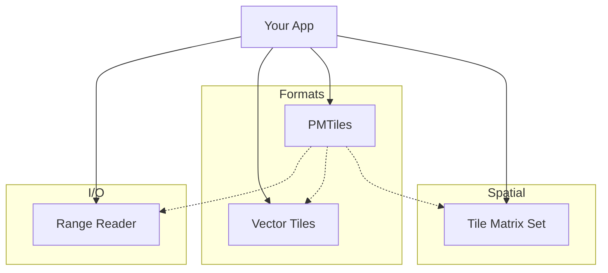

# Tileverse

Tileverse provides a toolkit of independent Java libraries for building cloud-native geospatial applications. 

These libraries are designed to be **composable**: pick the ones you need for your specific problem—whether that's reading from cloud storage, handling vector tiles, or calculating tile grids—without pulling in a monolithic framework.

## Libraries

| Library | Artifact | Role |
| :--- | :--- | :--- |
| **[Range Reader](rangereader/index.md)** | `tileverse-rangereader-all` | **I/O Abstraction**: Unified API for efficient byte-range access across S3, Azure, GCS, HTTP, and local files. |
| **[PMTiles](pmtiles/index.md)** | `tileverse-pmtiles` | **Archive Format**: Read/write support for PMTiles v3, leveraging Range Reader for cloud access. |
| **[Vector Tiles](vectortiles/index.md)** | `tileverse-vectortiles` | **Codec**: High-performance encoding and decoding of Mapbox Vector Tiles (MVT) to/from JTS Geometries. |
| **[Tile Matrix Set](tilematrixset/index.md)** | `tileverse-tilematrixset` | **Math & Logic**: Implementation of the OGC Tile Matrix Set standard for calculating tile pyramids and grids. |

## Ecosystem

While `tileverse-pmtiles` naturally uses the other libraries, **Range Reader**, **Vector Tiles**, and **Tile Matrix Set** are completely standalone. 

*   Building a tile server from PostGIS? Use **Vector Tiles** and **Tile Matrix Set**.
*   Reading COGs (Cloud Optimized GeoTIFFs)? Use **Range Reader**.
*   Need a standard grid definition? Use **Tile Matrix Set**.

