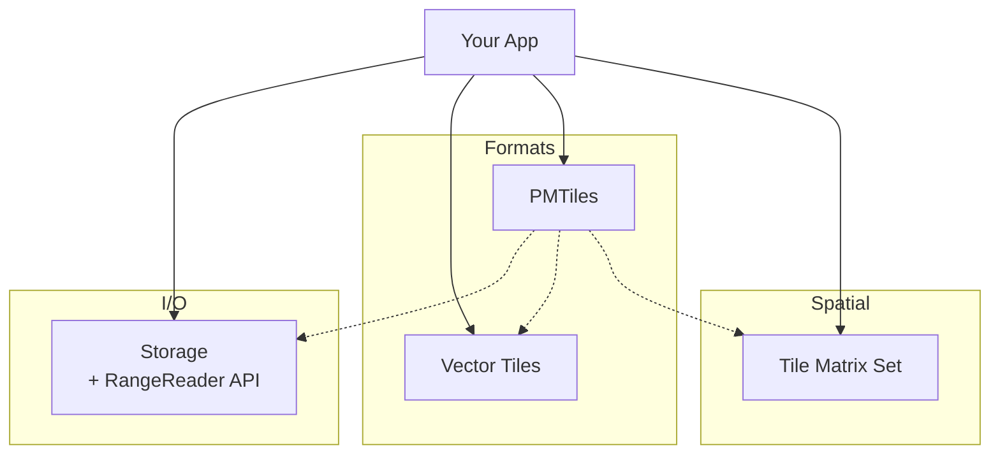

# Tileverse

Tileverse provides a toolkit of independent Java libraries for building cloud-native geospatial applications. 

These libraries are designed to be **composable**: pick the ones you need for your specific problem—whether that's reading from cloud storage, handling vector tiles, or calculating tile grids—without pulling in a monolithic framework.

## Libraries

| Library | Artifact | Role |
| :--- | :--- | :--- |
| **[Storage](storage/index.md)** | `tileverse-storage-all` | **Object Storage Abstraction**: Full container API (list, range/streaming reads, atomic writes, deletes, server-side copy, presigned URLs) across local files, HTTP, S3 (GP + Express), Azure (Blob + Data Lake Gen2), and GCS (flat + HNS). Includes the byte-range [`RangeReader`](storage/rangereader/index.md) API used by PMTiles, COG, and single-file Parquet. |
| **[PMTiles](pmtiles/index.md)** | `tileverse-pmtiles` | **Archive Format**: Read/write support for PMTiles v3, leveraging Storage / RangeReader for cloud access. |
| **[Vector Tiles](vectortiles/index.md)** | `tileverse-vectortiles` | **Codec**: High-performance encoding and decoding of Mapbox Vector Tiles (MVT) to/from JTS Geometries. |
| **[Tile Matrix Set](tilematrixset/index.md)** | `tileverse-tilematrixset` | **Math & Logic**: Implementation of the OGC Tile Matrix Set standard for calculating tile pyramids and grids. |

## Ecosystem

While `tileverse-pmtiles` naturally uses the other libraries, **Storage**, **Vector Tiles**, and **Tile Matrix Set** are completely standalone.

*   Building a GeoParquet datastore that needs to list and read partitioned files in S3 / Azure / GCS? Use **Storage**.
*   Reading COGs (Cloud Optimized GeoTIFFs) with byte-range requests? Use **Storage** (its `RangeReader` API) directly.
*   Building a tile server from PostGIS? Use **Vector Tiles** and **Tile Matrix Set**.
*   Need a standard grid definition? Use **Tile Matrix Set**.

```mermaid
graph TD
    App[Your App]

    subgraph "I/O"
        ST[Storage<br/>+ RangeReader API]
    end

    subgraph "Formats"
        VT[Vector Tiles]
        PMT[PMTiles]
    end

    subgraph "Spatial"
        TMS[Tile Matrix Set]
    end

    App --> ST
    App --> VT
    App --> PMT
    App --> TMS

    PMT -.-> ST
    PMT -.-> VT
    PMT -.-> TMS
```
